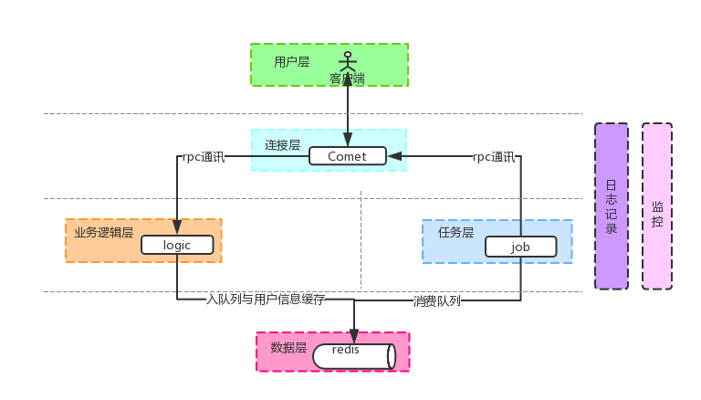
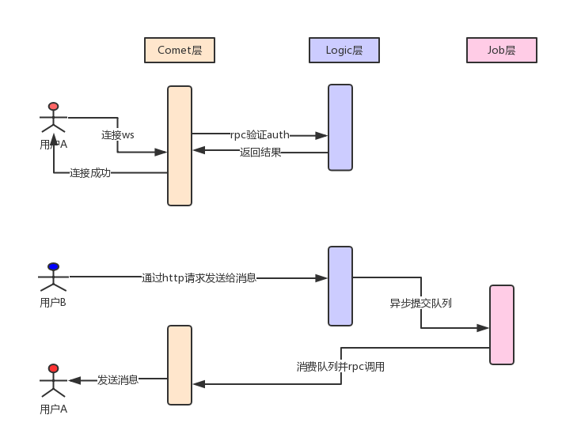

# 声明
修改自[GitHub](https://github.com/Terry-Ye/im)，调整为使用mod做包管理工具，相关包做了版本升级，
去除了对zookeeper的使用，全部做单机部署，RPC调用使用直连的方式。

### 简介
纯go实现的im即时通讯系统，各层可单独部署，之间通过rpc通讯，支持集群，学习于goim, 另使用于zookeeper,扩展性会大大增强, 总分三层
1. comet（用户连接层），可以直接部署多个节点，每个节点保证serverId 唯一，在配置文件comet.toml
2. logic（业务逻辑层），无状态，各层通过rpc通讯，容易扩展，支持http接口来接收消息
3. job（任务推送层）通过redis 订阅发布功能进行推送到comet层。

### 架构图


### 时序图
以下Comet 层，Logic 层，Job层都可以灵活扩展机器



### 特性
1. 分布式，可拓扑的架构
2. 支持单个，房间推送
3. 心跳支持（gorilla/websocket内置）
4. 基于redis 做消息推送
5. 轻量级
6. 持续迭代...

### 部署
1. 安装
```
go get -u github.com/Terry-Ye/im
mv $GOPATH/src/github.com/Terry-Ye/im $GOPATH/src/im
cd $GOPATH/src/im
go get ./...
# 需要使用zookeeper服务 文档最底有安装启动方法
go get -u -v -tags "zookeeper" github.com/smallnest/rpcx/...


```

golang.org 包拉不下来的情况，例
```
package golang.org/x/net/ipv4: unrecognized import path "golang.org/x/net/ipv4" (https fetch: Get https://golang.org/x/net/ipv4?go-get=1: dial tcp 216.239.37.1:443: i/o timeout)
```

从github 拉下来，再移动位置
```

git clone https://github.com/golang/net.git
mkdir -p golang.org/x/

mv net $GOPATH/src/golang.org/x/
```

2. 部署im
安装comet、logic、job模块
```
# 注意：第一次需要先启动logic ，因为要注册 服务端的zookeeper, 不然先启动comet会报错，第二次则不需要
cd ../logic/
mv logic.toml.example logic.toml
go install -tags zookeeper   # 或 go run  -tags zookeeper *.go
$GOPATH/bin/logic d $GOPATH/src/im/logic/
# nohup $GOPATH/bin/logic d $GOPATH/src/im/logic/ 2>&1 > /data/log/im/logic.log &

cd $GOPATH/src/im/comet
mv comet.toml.example comet.toml
go install -tags zookeeper  # 或 go run  -tags zookeeper *.go
# 启动
$GOPATH/bin/comet d $GOPATH/src/im/comet/
# nohup $GOPATH/bin/comet d $GOPATH/src/im/comet/ 2>&1 > /data/log/im/comet.log &


cd ../job
mv job.toml.example job.toml
go install # 或 go run *.go
$GOPATH/bin/job d $GOPATH/src/im/job/
# nohup $GOPATH/bin/job d $GOPATH/src/im/job/ 2>&1 > /data/log/im/job.log &


// demo页面执行
cd $GOPATH/src/im/demo
go run main.go

```

3. [im_api](https://github.com/Terry-Ye/im_api)  是im系统中使用的接口，需要像demo那样整体跑起来需要完整的部署

### 部署注意事项
1. 部署服务器注意防火墙是否开放对应的端口(本地不需要，具体需要的端口在各层的配置文件)

### demo
聊天室：https://www.texixi.com:1999/


### 使用的包
* log: github.com/sirupsen/logrus
* rpc: github.com/smallnest/rpcx
* websocket: github.com/gorilla/websocket
* 配置文件读取：github.com/spf13/viper


### zookeeper 安装
```
    wget http://mirrors.hust.edu.cn/apache/zookeeper/stable/zookeeper-3.4.12.tar.gz
    tar -zxvf zookeeper-3.4.12.tar.gz
    cd zookeeper-3.4.12/conf/
    mv zoo_sample.cfg zoo.cfg //更改默认配置文件名称
    vi zoo.cfg //编辑配置文件，自定义dataDir
    cd ../bin
    ./zkServer.sh start //启动
```

### 后续计划
1. 监控
2. 聊天机器人

## 使用
启动logic  再启动comet 再启动job

logic启动http服务，处理发送过来的消息，然后发布到redis
根据当前用户的认证信息进行认证
查key im_auth 获取认证信息 userid username
查key im_userid 获取分配的comet服务id
将消息发布到redis key  go_im_sub

job订阅并且推送到comet
启动几个协程，然后每个协程处理一个chan通道数据，从通道拿到数据后，根据消息中的comet选中去推送

